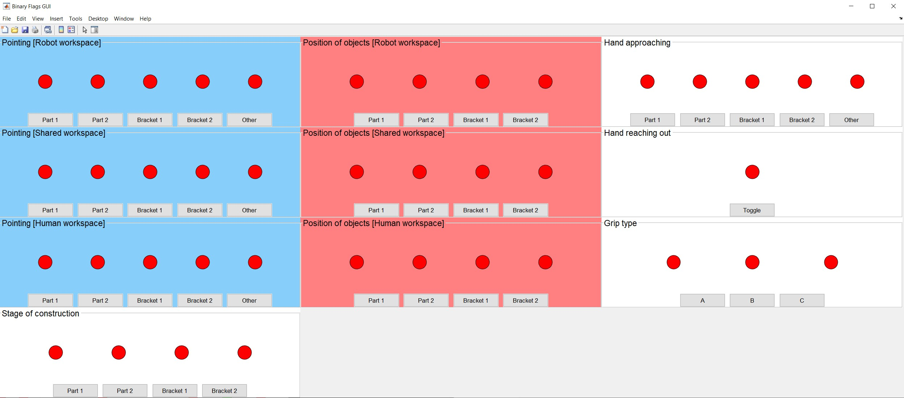
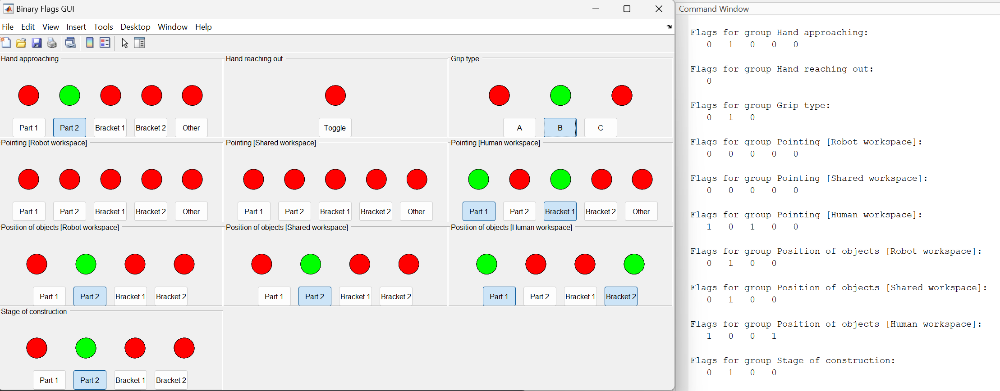

# icater-vision-mock

A MATLAB-based graphical user interface (GUI) for mocking inputs from the vision system in the I-CATER project.



## File overview

```
├── main.m
├── gui/
│   ├── BinaryFlagsGUI.m
│   └── callGUI.m
└── README.md
```

- `BinaryFlagsGUI.m`: This file contains the definition of the `BinaryFlagsGUI` class. It creates a GUI with multiple flag groups and allows users to toggle the flags within each group.
- `callGUI.m`: This file is a function that creates an instance of the `BinaryFlagsGUI` class and returns it. It sets up the necessary parameters, such as the number of flag groups, names of groups, and names of flags per group. This function is responsible for initializing and configuring the GUI.
- `main.m`: This file contains the main script that utilizes the `BinaryFlagsGUI` class. It creates an instance of the GUI by calling `callGUI()` and enters a while loop that continues until the GUI window is closed. Within the loop, it retrieves the flag values from the GUI and prints them for each flag group. This script demonstrates how to interact with the GUI and retrieve the flag values dynamically.

## Usage

1. Ensure that the `BinaryFlagsGUI.m` class file is available in the MATLAB path.
2. Run the `main.m` script in MATLAB.
3. The GUI window will appear, displaying flag groups and flags.
4. Interact with the GUI by toggling the flags on or off.
5. The state of the flags will be printed in the MATLAB command window, reflecting the changes made in the GUI.
6. Continue interacting with the GUI until you're done.
7. Close the GUI window to exit the program.

## GUI Description

The GUI consists of flag groups, each containing multiple flags that can be toggled on or off. Each flag group is labeled with a name, and each flag within a group is also labeled. The GUI provides visual feedback using colored semaphores for each flag, indicating its state. Green indicates an active (true) flag, while red indicates an inactive (false) flag.



---

# BinaryFlagsGUI Class

The `BinaryFlagsGUI` class is responsible for creating and managing the GUI. It provides methods to toggle flags, retrieve flag values, and check the status of the GUI window.

## Class Structure

The `BinaryFlagsGUI` class has the following properties:

- `numGroups`: The number of flag groups.
- `flagsPerGroup`: An array specifying the number of flags in each group.
- `flags`: A cell array that stores the state of each flag.
- `fig`: The handle to the figure window of the GUI.
- `semaphoreAxes`: A cell array that stores the handles to the semaphore axes.
- `namesOfGroups`: A cell array containing the names of the flag groups.
- `namesOfFlagsPerGroup`: A cell array containing the names of the flags within each group.

## Constructor

The `BinaryFlagsGUI` class is instantiated using the following constructor:

```matlab
gui = BinaryFlagsGUI(numGroups, flagsPerGroup, namesOfGroups, namesOfFlagsPerGroup, titleFontSize, labelFontSize, groupColors)
```

- `numGroups`: The number of flag groups.
- `flagsPerGroup`: An array specifying the number of flags in each group.
  namesOfGroups: A cell array containing the names of the flag groups.
- `namesOfFlagsPerGroup`: A cell array containing the names of the flags within each group.
- `titleFontSize`: The font size for the group titles in the GUI.
- `labelFontSize`: The font size for the flag labels in the GUI.
- `groupColors`: A matrix specifying the colors for each group in the GUI. Each row of the matrix represents the RGB values for a group color.

## GUI creation

The `createGUI` method creates the GUI window, flag panels, semaphore axes, and toggle buttons for each flag group.

### Flag toggling

The state of each flag can be toggled by clicking the corresponding toggle button in the GUI. The `toggleFlag` method handles the flag toggling logic and updates the flag state accordingly.

### Semaphore visualization

Each flag is represented by a semaphore, which visually indicates its state using colors. Green indicates an active (true) flag, while red indicates an inactive (false) flag. The `drawSemaphore` method updates the color of the semaphore based on the flag state.

## Getting flag values

The `getFlags` method returns the current state of all flags as a cell array.

```matlab
flags = gui.getFlags();
```

The `getFlagsPerGroup` method allows retrieving the flags associated with a specific group by providing the group name as an input.

```matlab
groupFlags = gui.getFlagsPerGroup(groupName);
```

## Checking GUI window status

The `isGUIWindowClosed` method checks if the GUI window is closed.

```matlab
isClosed = gui.isGUIWindowClosed();
```

## Getting group and flag information

The `getNumGroups` method returns the total number of flag groups.

```matlab
numOfGroups = gui.getNumGroups();
```

The `getGroupName` method returns the name of a flag group based on its index.

```matlab
groupName = gui.getGroupName(groupIndex);
```

## Example usage

Here's an example that demonstrates how to use the `BinaryFlagsGUI` class:

```matlab
numGroups = 2;
flagsPerGroup = [3, 2];
namesOfGroups = {'Group 1', 'Group 2'};
namesOfFlagsPerGroup = {'Flag A', 'Flag B', 'Flag C', 'Flag D', 'Flag E'};
titleFontSize = 14;
labelFontSize = 10;
groupColors = [0.5, 0.5, 1; 1, 0.5, 0.5]; % Example group colors (RGB values)
gui = BinaryFlagsGUI(numGroups, flagsPerGroup, namesOfGroups, namesOfFlagsPerGroup, titleFontSize, labelFontSize, groupColors);

while ~gui.isGUIWindowClosed()
    flags = gui.getFlags();
    disp(flags);
    pause(0.1);
end
```

In this example, we create a GUI with two flag groups: 'Group 1' and 'Group 2'. 'Group 1' contains three flags ('Flag A', 'Flag B', 'Flag C'), and 'Group 2' contains two flags ('Flag D', 'Flag E'). We also specify the titleFontSize as 14 and labelFontSize as 10 to set the desired font sizes for the group titles and flag labels in the GUI. Additionally, we provide an example groupColors matrix to set the colors for each group.

The script enters a while loop that continues until the GUI window is closed. Within the loop, it retrieves the state of all flags using getFlags() and displays them using disp(). The pause(0.1) statement introduces a small delay between each iteration of the loop to avoid excessive CPU usage.

Feel free to modify the code and adapt it to your specific requirements!
